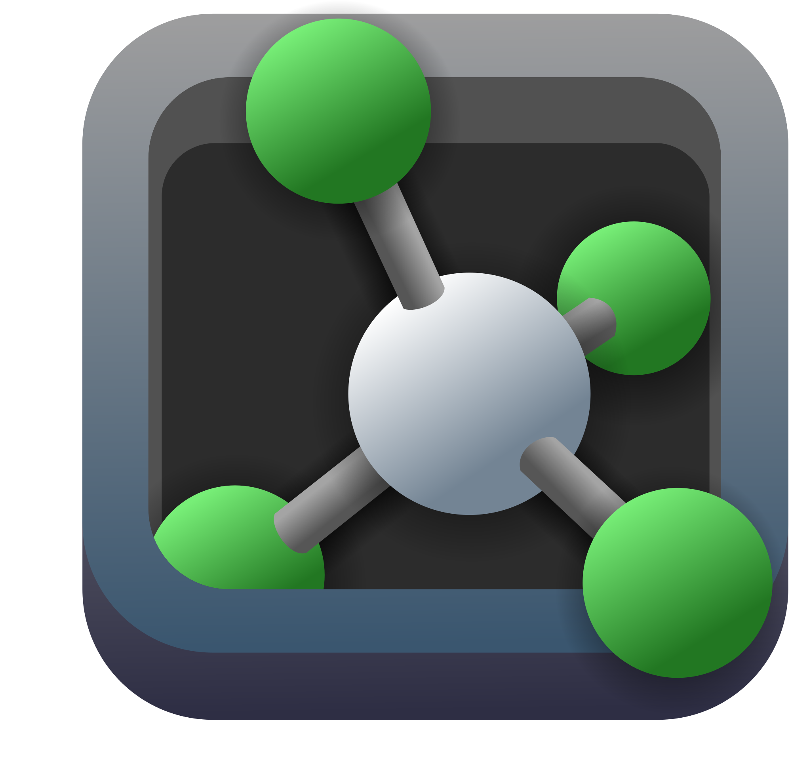

# 
 System.out.println("Hi there, I'm Rayane Adam") //👋

🎓 I'm a senior undergraduate student majoring in Bioinformatics at [Lebanese American University](https://www.lau.edu.lb/).

## ✨ About Me

 Currently learning **deep learning**  
 Intrested in applying __machine learning to solve biological problems__  
 Aquired a solid background in _computer science, biology, math and chemistry_

##  Languages and Tools

    
    
    
    
    
    
    
    
    
    
    
    
    
    
    

##  Bioinformatics Tools and Databases

    
    
    
    
    
    
    
    

##   Contact Me

Feel free to reach out. Let's connect and explore the fascinating world of bioinformatics, machine learning, and more!

    

    
    
    

     
    

