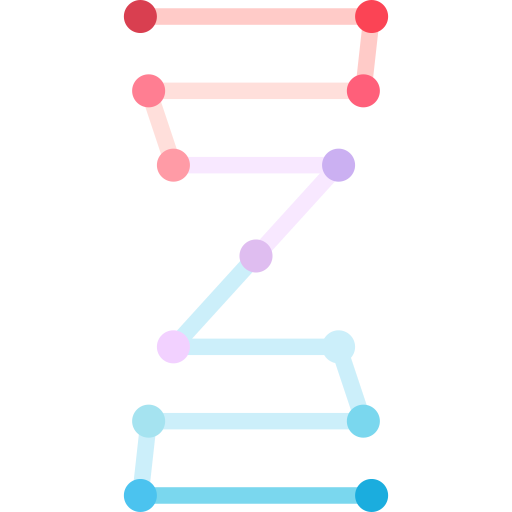

# 
 System.out.println("Hi there!") // : )

##   About Me

🎓 I'm a senior undergraduate student majoring in Bioinformatics at [Lebanese American University](https://www.lau.edu.lb/). 

##  Languages and Tools

    

    

<!-- figma, matlab -->

##  Packages and Softwares

    
    
    
    
    <!--  -->
    

    

    
    
    
    
    
    
    

    

    

     

    <i>Reach out and connect with me on:</i>

    
    
    

