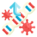
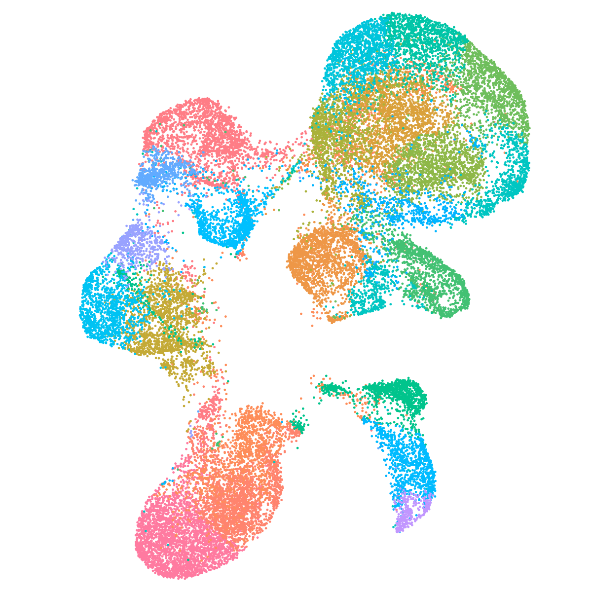
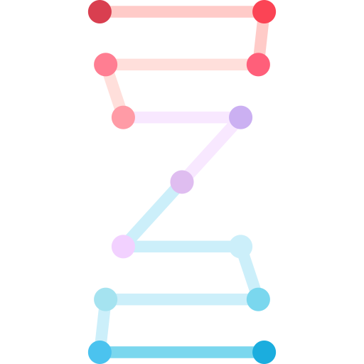
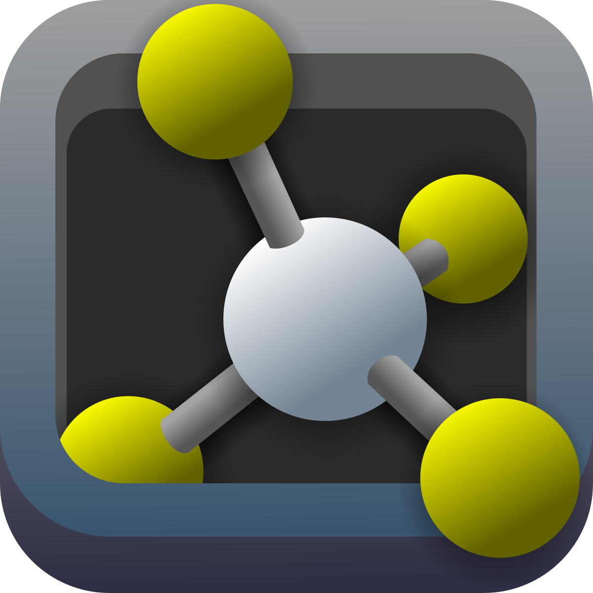

# 
 Hello! I'm rayane ✌️

<!--  -->

##  About Me

I am a bioinformatics graduate from [LAU](https://www.lau.edu.lb/), intrested in applying computational methods on biological data. 

<!-- got it from https://img.icons8.com/?size=100&id=12383&format=png&color=000000 -->
 Currently learning ***Network Science*** and ***Deep Learning***   
 Volunteering in a ***Microbial Genomics dry-lab***  
 Performing data preprocessing & analysis on biological data files, mainly ___NGS___  
 Eager to learn more about different omics, particularly ___single-cell transcriptomics___  

###  Connect with me

    
    
    

 

 e-mail me on:  
* [X] rayane.s.adam@gmail.com  
* [X] rayane.adam@lau.edu

##  Languages and Tools

    

    

<!-- figma, matlab, docker -->

##  Packages and Softwares

    

        
        
        
        
        <!--  -->
    

    

        
        
        
        
        
        
    

<!-- bioconductor packages -->

     

<!-- 

    <i>Reach out and connect with me on:</i>

    
    
    

 -->