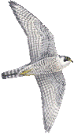

# 
 Hello! I'm rayane ✌️

<!--  -->

##  About Me

I am a bioinformatics graduate from [LAU](https://www.lau.edu.lb/), intrested in applying computational methods on biological data. 

<!-- got it from https://img.icons8.com/?size=100&id=12383&format=png&color=000000 -->
 Currently learning ***Network Science*** and ***Deep Learning***   
 Volunteering in a ***Microbial Genomics dry-lab***  
 Performing data preprocessing & analysis on biological data files, mainly ___NGS___  
 Eager to learn more about different omics, particularly ___single-cell transcriptomics___  

###  Connect with me

    
    
    

 

 e-mail me on:  
* [X] rayane.s.adam@gmail.com  
* [X] rayane.adam@lau.edu

###  languages & tools 
<table>
    <tr>
        <td><i>languages</i></td>
        <td>
            
            
            
            
            
            
            
        </td>
    </tr>
    <tr>
        <td><i>tools</i></td>
        <td>
            
            
            
            
            
            
            
            
            
        </td>
    </tr>
    <tr>
        <td><i>operating systems</i></td>
        <td>
            
            
            
        </td>
    </tr>
    <tr>
        <td><i>packages & softwares</i></td>
        <td>
            
            
            
            
            
            
            
            <!--   -->
            
            
            
            
            
        </td>
    </tr>
    <tr>
        <td><i>bioinformatics tools</i></td>
        <td>
            
            
            
            <!--  -->
            <!--  -->
            
            
            
            
        </td>
    </tr>
</table>

  
    

     

<!-- 

    <i>Reach out and connect with me on:</i>

    
    
    

 -->